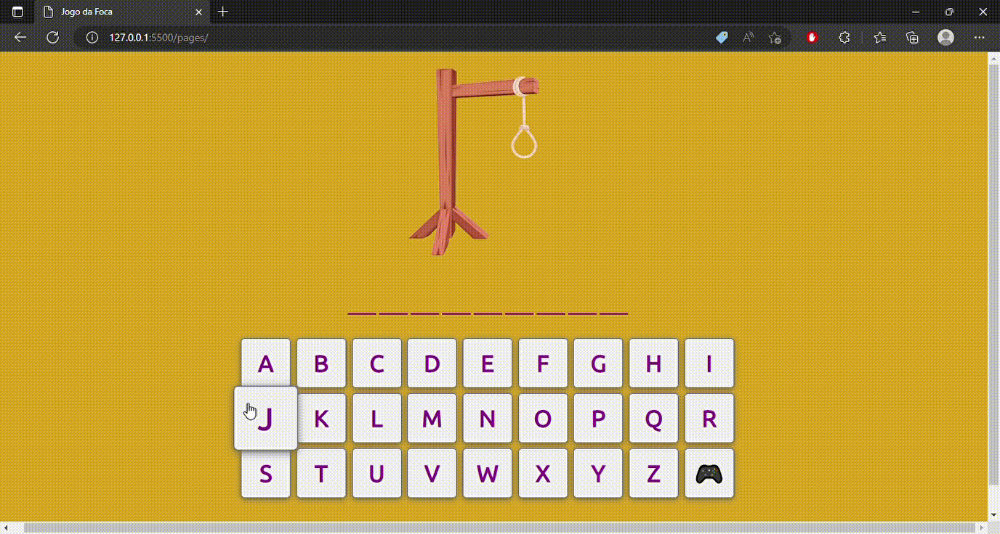

  

    
  

# Jogo-da-forca
Um simples jogo da forca 2D

## Resumo
Este projeto tem como objetivo a criação de um jogo, para exercicio das minhas habilidades como programador especificamente nas habilidades com Javascript e CSS3.
Futuramente serão adicionados:

| Recurso | Prioridade |
| ------ | ------ |
| Implantar um Timer | 1 |
| Opção de nível de dificuldade | 1 |
| Contador de pontuações | 2 |
| Opção de reinicialização | 2 |
| Tela de Game Over | 2 |
| Tela de Parabén + proximo jogo | 2 |

## Como rodar

### No Visual Studio Code ou via Browser
Realize o download do projeto e execute a pagina index.html

## Dependencias
Este projeto não possui dependências.

## Esta aplicação utiliza: 
JAVASCRIPT, HTML5, CSS3, GIT e GOOGLE FONTS;

